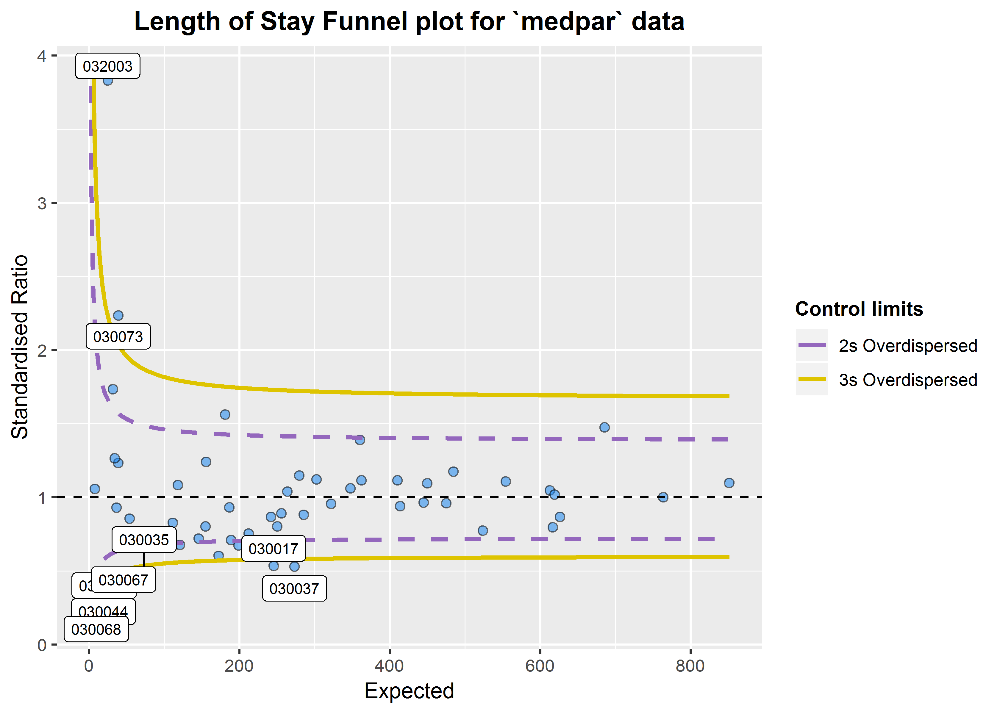

Funnel plots for risk-adjusted indicators
================
Chris Mainey
10 April 2019

Funnel plots
------------

This is an implementation of the funnel plot processes, and overdispersion methods described in:<br> [Statistical methods for healthcare regulation: rating, screening and surveillance. Spiegelhalter et al (2012)](https://rss.onlinelibrary.wiley.com/doi/full/10.1111/j.1467-985X.2011.01010.x)<br> [Funnel plots for comparing institutional performance. Spiegelhalter (2004)](https://onlinelibrary.wiley.com/doi/10.1002/sim.1970)<br> [Handeling over-dispersion of performance indicators. Spiegelhalter (2005)](https://qualitysafety.bmj.com/content/14/5/347)<br>

It draws funnel plots using `ggplot2` and allows users to specify whether they want 'overdispersed' limits, setting a Winsorisation percentage (default 10%)

There is a variant method for this, used in the NHS' Summary Hospital Mortality Indicator'<br> [Summary Hospital-level Mortality Indicator, NHS Digital, SHMI specification](https://digital.nhs.uk/data-and-information/publications/ci-hub/summary-hospital-level-mortality-indicator-shmi) <br>

This uses a log-transformation and truncation of the distribution for calculating overdispersion, whereas Spieglehalter's methods use a square-root and Winsorisation.

This package was originally developed for use in CM's PhD project, but published on github in case it's of use for others.

Installation
------------

``` r
devtools::install_github("https://github.com/chrismainey/CMFunnels")
```

Summary of Use
--------------

We will load the `medpar` dataset from Hilbe's `COUNT` package. This is based on 1991 Medicare files for the state of Arizona *(Hilbe, Joseph M (2014), Modeling Count Data, Cambridge University Press Hilbe)* We will first load the data and build a simple predicitive model using a Poisson GLM.

``` r
library(CMFunnels)
library(COUNT)
library(ggplot2)

# lets use the \'medpar\' dataset from the \'COUNT\' package. Little reformatting needed
data(medpar)
medpar$provnum<-factor(medpar$provnum)
medpar$los<-as.numeric(medpar$los)

mod<- glm(los ~ hmo + died + age80 + factor(type), family="poisson", data=medpar)
summary(mod)
```

    ## 
    ## Call:
    ## glm(formula = los ~ hmo + died + age80 + factor(type), family = "poisson", 
    ##     data = medpar)
    ## 
    ## Deviance Residuals: 
    ##     Min       1Q   Median       3Q      Max  
    ## -5.7309  -1.9554  -0.5529   0.9717  14.5487  
    ## 
    ## Coefficients:
    ##               Estimate Std. Error z value Pr(>|z|)    
    ## (Intercept)    2.26875    0.01246 182.011  < 2e-16 ***
    ## hmo           -0.07637    0.02393  -3.192  0.00142 ** 
    ## died          -0.24574    0.01826 -13.458  < 2e-16 ***
    ## age80         -0.02141    0.02050  -1.045  0.29617    
    ## factor(type)2  0.24921    0.02099  11.871  < 2e-16 ***
    ## factor(type)3  0.74869    0.02627  28.496  < 2e-16 ***
    ## ---
    ## Signif. codes:  0 '***' 0.001 '**' 0.01 '*' 0.05 '.' 0.1 ' ' 1
    ## 
    ## (Dispersion parameter for poisson family taken to be 1)
    ## 
    ##     Null deviance: 8901.1  on 1494  degrees of freedom
    ## Residual deviance: 7977.7  on 1489  degrees of freedom
    ## AIC: 13705
    ## 
    ## Number of Fisher Scoring iterations: 5

Now we have a regression that we can use to get a predicted `los` that we will compare to observed `los`:

``` r
medpar$prds<- predict(mod, type="response")
```

<br><br> Now we can build a funnel plot object with standard Poisson limits, and outliers labelled. The function returns a list of the plotted data, the plotted control limit range, and the ggplot object, hence `object[3]` to call it.

``` r

my_plot<-funnel_plot(predictions=medpar$prds,observed=medpar$los, group = medpar$provnum, 
            title = 'Length of Stay Funnel plot for `medpar` data', 
            Poisson_limits = TRUE, OD_Tau2 = FALSE,label_outliers = TRUE)

my_plot[3]
## [[1]]
```


<br><br>

That looks like too many outliers! There is more variation in our data than we would expect, and this is referrred to as: **overdispersion**. So lets check for it: <br> The following ratio should be 1 if our data are conforming to Poisson distribution assumption (conditional mean = variance). If it is greater than 1, we have overdispersion:

``` r
sum(mod$weights * mod$residuals^2)/mod$df.residual
```

    ## [1] 6.240519

This suggest the variance is 6.24 times the condition mean, and definitely overdispersed. This is a huge topic, but applying overdispersed limits using either SHMI or Spieglehalter methods adjust for this by inflating the limits:

``` r

my_plot2<-funnel_plot(predictions=medpar$prds,observed=medpar$los, group = medpar$provnum, 
            title = 'Length of Stay Funnel plot for `medpar` data', 
            Poisson_limits = FALSE, OD_Tau2 = TRUE, method = "SHMI",label_outliers = TRUE)

my_plot2[3]
## [[1]]
```



<br><br> These methods can be used for any similar indicators, e.g. standardised mortality ratios, readmissions etc.

**Please read the package documentation for more info**
