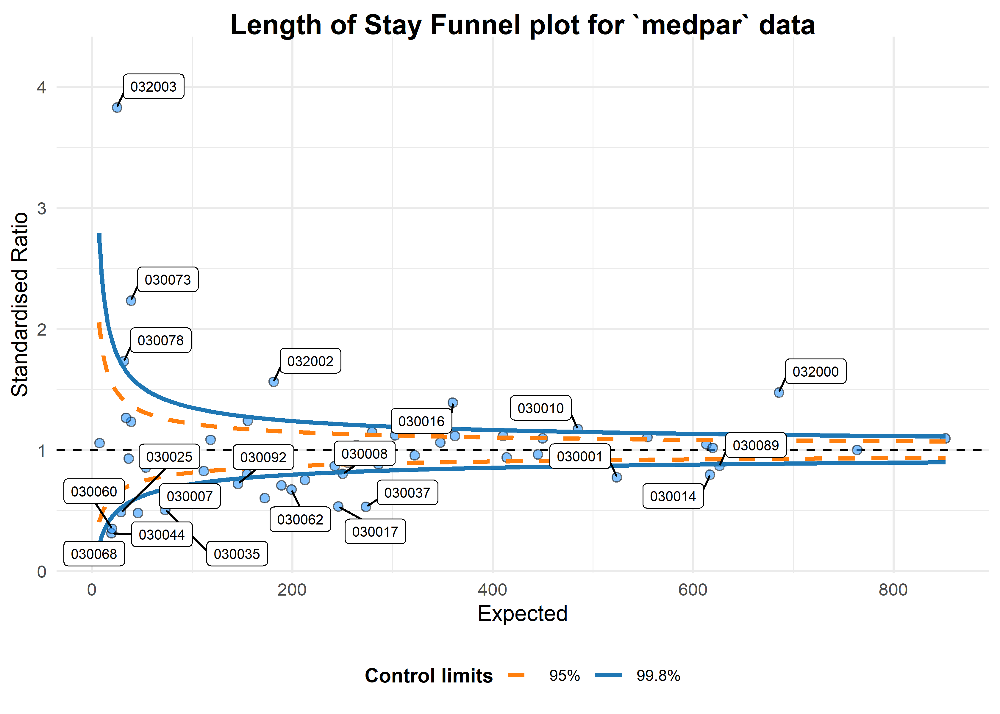
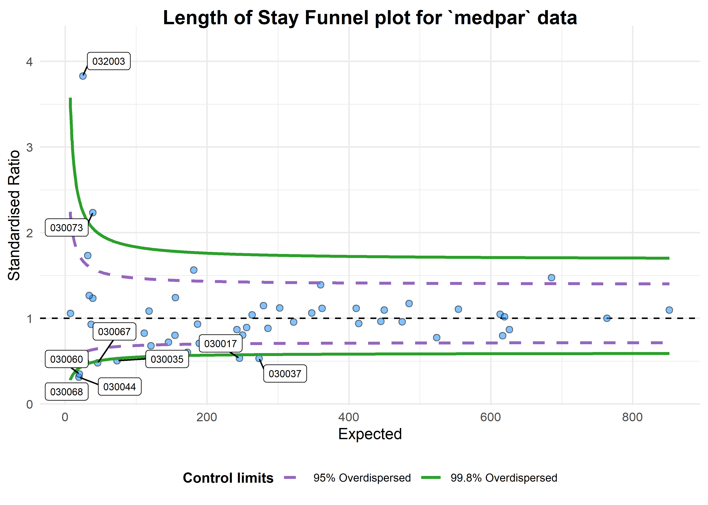

# Funnel Plots for Comparing Institutional Performance 

<!-- badges: start -->

[](https://www.repostatus.org/#active)
[](https://cran.r-project.org/package=FunnelPlotR)
 [](https://codecov.io/gh/chrismainey/FunnelPlotR?branch=master)
[](https://github.com/nhs-r-community/FunnelPlotR/actions)
<!-- badges: end -->

## Funnel Plots

**This package is the newer version of the older `CMFunnels` package.
Development work will focus on this package from now on.**

This is an implementation of the funnel plot processes, and
overdispersion methods described in:<br> [Statistical methods for
healthcare regulation: rating, screening and surveillance. Spiegelhalter
et al
(2012)](https://rss.onlinelibrary.wiley.com/doi/full/10.1111/j.1467-985X.2011.01010.x)<br>
[Funnel plots for comparing institutional performance. Spiegelhalter
(2005)](https://onlinelibrary.wiley.com/doi/10.1002/sim.1970)<br>
[Handling over-dispersion of performance indicators. Spiegelhalter
(2005)](https://qualitysafety.bmj.com/content/14/5/347)<br>

It draws funnel plots using `ggplot2` and allows users to specify
whether they want to adjust the funnel plot limits for ‘overdispersion.’
This adjustment makes the assumption that we are dealing with clusters
of values (means) at institutions that are themselves arranged around a
global mean. We then have ‘within’ institution variation and ‘between
institution’ variation. The process assessed the expected variance in
our data, and where it is greater than that expected by the Poisson
distribution, uses the difference as a scaling factor. It is then used
in an additive fashion, after an adjustment for outliers by either
Winsorised or truncated (with a default 10% at each end of the
distribution.)

Methods are based on those presented in Spiegelhalter’s papers and the
Care Quality Commission’s Intelligent Monitoring methodology documents,
with methods for proportions, ratios of counts and indirectly
standardised ratios. There is a also a variant method for standardised
ratios, used in the NHS’ Summary Hospital Mortality Indicator’<br>
[Summary Hospital-level Mortality Indicator, NHS Digital, SHMI
specification](https://digital.nhs.uk/data-and-information/publications/ci-hub/summary-hospital-level-mortality-indicator-shmi)
<br>

This variant uses a log-transformation and truncation of the
distribution for calculating overdispersion, whereas Spiegelhalter’s
methods use a square-root and Winsorisation.

Contributions are welcome. Please note that the ‘FunnelPlotR’ project is
released with a [Contributor Code of
Conduct](https://nhs-r-community.github.io/FunnelPlotR/CODE_OF_CONDUCT.html).
By contributing to this project, you agree to abide by its terms.

More information available at
<https://nhs-r-community.github.io/FunnelPlotR/>

## Installation

You can install from CRAN:

``` r
install.packages("FunnelPlotR")
```

You can install the development version directly from GitHub using the
`remotes` (or `devtools`) package. Please be aware that, although I
endeavour have help files up-to-date, this version may different from
the one on CRAN. Please consult the help documentation if you get error
messages.

``` r
remotes::install_github("https://github.com/nhs-r-community/FunnelPlotR")
```

## Summary of Use

We will load the `medpar` dataset from Hilbe’s `COUNT` package. This is
based on 1991 Medicare files for the state of Arizona *(Hilbe, Joseph M
(2014), Modeling Count Data, Cambridge University Press)*. We will first
load the data and build a simple predictive model using a Poisson GLM.

``` r
library(FunnelPlotR)
library(COUNT)
library(ggplot2)

# lets use the 'medpar' dataset from the 'COUNT' package. Little reformatting needed
data(medpar)
medpar$provnum<-factor(medpar$provnum)
medpar$los<-as.numeric(medpar$los)

mod<- glm(los ~ hmo + died + age80 + factor(type), family="poisson", data=medpar)
summary(mod)
#> 
#> Call:
#> glm(formula = los ~ hmo + died + age80 + factor(type), family = "poisson", 
#>     data = medpar)
#> 
#> Deviance Residuals: 
#>     Min       1Q   Median       3Q      Max  
#> -5.7309  -1.9554  -0.5529   0.9717  14.5487  
#> 
#> Coefficients:
#>               Estimate Std. Error z value Pr(>|z|)    
#> (Intercept)    2.26875    0.01246 182.011  < 2e-16 ***
#> hmo           -0.07637    0.02393  -3.192  0.00142 ** 
#> died          -0.24574    0.01826 -13.458  < 2e-16 ***
#> age80         -0.02141    0.02050  -1.045  0.29617    
#> factor(type)2  0.24921    0.02099  11.871  < 2e-16 ***
#> factor(type)3  0.74869    0.02627  28.496  < 2e-16 ***
#> ---
#> Signif. codes:  0 '***' 0.001 '**' 0.01 '*' 0.05 '.' 0.1 ' ' 1
#> 
#> (Dispersion parameter for poisson family taken to be 1)
#> 
#>     Null deviance: 8901.1  on 1494  degrees of freedom
#> Residual deviance: 7977.7  on 1489  degrees of freedom
#> AIC: 13705
#> 
#> Number of Fisher Scoring iterations: 5
```

Now we have a regression that we can use to get a predicted `los` that
we will compare to observed `los`:

``` r
medpar$prds<- predict(mod, type="response")
```

<br><br> We can build a funnel plot object with standard Poisson limits,
and outliers labelled.

``` r
a<-funnel_plot(numerator=medpar$los, denominator=medpar$prds, group = medpar$provnum, 
            title = 'Length of Stay Funnel plot for `medpar` data', data_type="SR", limit=99,
            draw_unadjusted = TRUE, draw_adjusted = FALSE, label="outlier")
print(a)
```



    #> A funnel plot object with 54 points of which 25 are outliers. 
    #> Plot is not adjusted for overdispersion.

<br><br>

That looks like too many outliers! There is more variation in our data
than we would expect, and this is referred to as: **overdispersion**. So
lets check for it: <br> The following ratio should be 1 if our data are
conforming to Poisson distribution assumption (conditional mean =
variance). If it is greater than 1, we have overdispersion:

``` r

sum(mod$weights * mod$residuals^2)/mod$df.residual
#> [1] 6.240519
```

This suggest the variance is 6.24 times the condition mean, and
definitely overdispersed. This is a huge topic, but applying
overdispersed limits using either SHMI or Spiegelhalter methods adjust
for this by inflating the limits:

``` r
b<-funnel_plot(numerator=medpar$los, denominator=medpar$prds, group = medpar$provnum, data_type = "SR",
            title = 'Length of Stay Funnel plot for `medpar` data', draw_unadjusted = FALSE,
            draw_adjusted = TRUE, sr_method = "SHMI", label="outlier", limit=99)

print(b)
```



    #> A funnel plot object with 54 points of which 9 are outliers. 
    #> Plot is adjusted for overdispersion.

<br><br> These methods can be used for any similar indicators,
e.g. standardised mortality ratios, readmissions etc.

Please read the package documentation for more info, at:
<https://nhs-r-community.github.io/FunnelPlotR/>

Funnel Plot HEX sticker/logo by Paul Chipperfield, check him out at:
<https://themightychip.com/>
